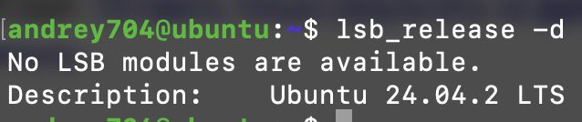
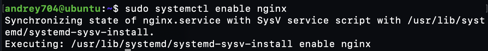
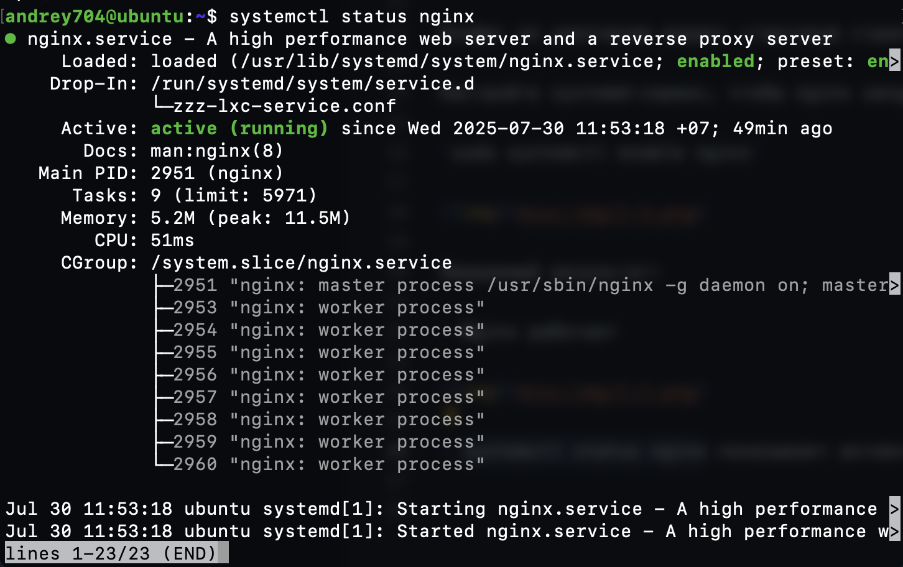

# Тестовое задание в ЗИТ: Junior DevOps / Системный администратор (Linux)

## 1. Подготовка тестового окружения:

- На своём локальном ПК или виртуалке (например, Ubuntu 20.04+):



- Установите и настройте nginx

`sudo apt-get update && sudo apt-get -y install nginx`

Конфиг по умолчанию выдает стартовую страничку nginx на порт 80.

- Настройте systemd-сервис, чтобы nginx запускался при старте системы

`sudo systemctl enable nginx`


- Ожидаемый результат:

- Nginx работает



- systemctl status nginx показывает активное состояние



## 2. Напишите простой .gitlab-ci.yml файл

- Сценарий:
- Этап test должен запускать проверку наличия установленного nginx:
- - bash
- - Copy
- - Edit
- - which nginx && nginx -v

- Ожидаемый результат:
- Корректный файл .gitlab-ci.yml с минимальным пайплайном

gitlab-ci.yml:
```yml
stages:
  - test

test_job:
  stage: test
  script:
    - which nginx && nginx -v
```

- Комментарии внутри объясняют, что делает каждая стадия