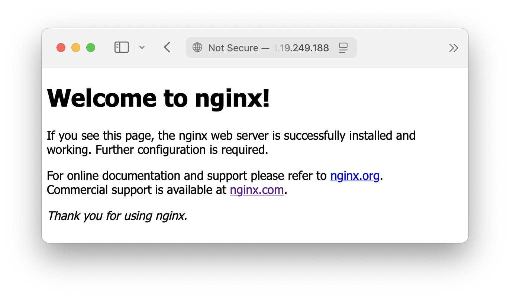
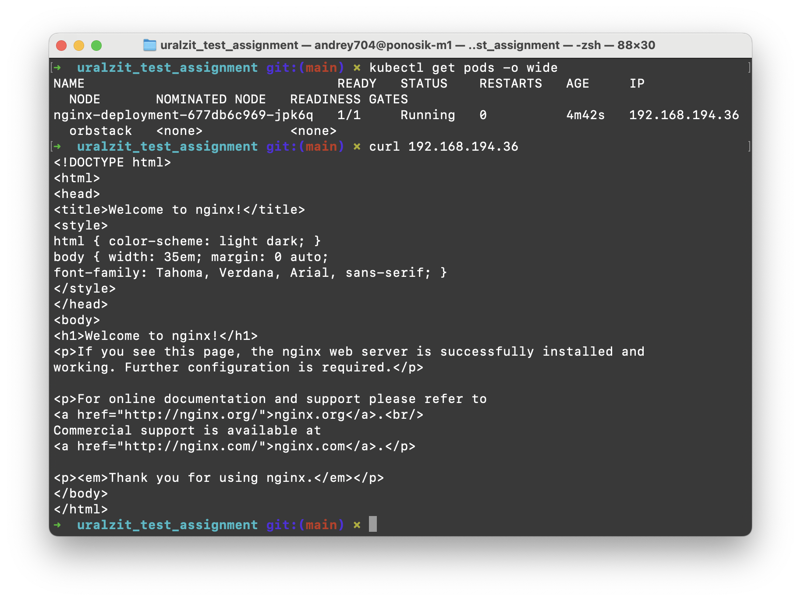

# Тестовое задание в ЗИТ: Junior DevOps / Системный администратор (Linux)

## 1. Подготовка тестового окружения:

- На своём локальном ПК или виртуалке (например, Ubuntu 20.04+):


- Установите и настройте nginx

`sudo apt-get update && sudo apt-get -y install nginx`

Конфиг по умолчанию выдает стартовую страничку nginx на порт 80.

- Настройте systemd-сервис, чтобы nginx запускался при старте системы

`sudo systemctl enable nginx`


- Ожидаемый результат:

- - Nginx работает



- - `systemctl status nginx` показывает активное состояние


## 2. Напишите простой .gitlab-ci.yml файл

- Сценарий:
- Этап test должен запускать проверку наличия установленного nginx:
- - which nginx && nginx -v

- Ожидаемый результат:
- - Корректный файл .gitlab-ci.yml с минимальным пайплайном
- - Комментарии внутри объясняют, что делает каждая стадия

gitlab-ci.yml:
```yml
stages:         # перечисление этапов
  - test        # название этапа

jobs:
  test_job:     # название джобы
    stage: test # к какому этапу относится джоба
    script:     # скрипт выполнения - проверка наличия nginx и вывод его версии
      - which nginx && nginx -v
```

Дополнительно запустил пайплайн на раннере:

Для запуска пайплайна развернул еще одну машину - gitlab-runner. 

В интерфейсе GitHub -> Settings -> Actions -> Runners - добавил нового раннера по их инструкции. 

.github/workflows/github-ci.yml:
```yml
name: test  # название github workflow

on: push    # триггер запуска пайплайна - при пуше в удаленный репозиторий в любую ветку

jobs:
  test_job:
    runs-on: self-hosted # запуск на определенной машине, в моем случае - машина с gitlab-runner
    steps:
      - name: nginx
        run: which nginx && nginx -v
```

Пайплайн фейлится, если на машине не установлен nginx:


После этого я установил nginx на машине раннера, заново запустил actions-runner и зареранил пайплайн:


## 3. Работа с Docker:
- Напишите Dockerfile, который собирает образ с nginx и выводит "Hello from DevOps!" на главной странице

Заменяю стандартную страничку nginx на свою (index.html) с нужным заголовком

```Dockerfile
FROM nginx:latest

COPY index.html /usr/share/nginx/html/index.html
```

index.html:
```html
<!DOCTYPE html>
<html>

<body>
    <h1>Hello from DevOps!</h1>
</body>

</html>
```

- Ожидаемый результат:
- Рабочий Dockerfile
- Контейнер поднимается и отвечает на curl localhost или через браузер

Пишу в консоль:
```
docker build -t nginx .
docker run -d -p 80:80 nginx
```


## 4. Мини-задание по YAML / Kubernetes:

- Напишите простейший deployment.yaml, который запускает nginx в 1 реплике

- Ожидаемый результат:
- - Корректный YAML-файл, описывающий Deployment
- - Используется nginx:stable
- - Указаны replicas, containers, ports

deployment.yaml:
```yaml
apiVersion: apps/v1
kind: Deployment
metadata:
  name: nginx-deployment
spec:
  selector:
    matchLabels:
      app: nginx
  replicas: 1                 # количество подов
  template:
    metadata:
      labels:
        app: nginx
    spec:
      containers:
      - name: nginx
        image: nginx:stable   # образ контейнера
        ports:
        - containerPort: 80   # порт контейнера, который будет открыт
```

Применяю конфигурацию командой:

`kubectl apply -f deployment.yaml`

Смотрю ip адрес пода и обращаюсь к ему по 80 порту:



5. Ответьте письменно на 3 вопроса:

- Чем отличается `apt update` от `apt upgrade`?

Ответ: `apt update` обновляет пакетный менеджер, а `apt upgrade` - установленные пакеты 

- Как вы проверите, слушает ли сервис нужный порт?

Ответ: `lsof -i :<port>`

- Какие команды вы используете для диагностики сетевых проблем?

Ответ: 

`ip a` - для вывода сетевых интерфейсов

`ip r` - для вывода таблицы маршрутизации

`arp -a` - вывод arp таблицы

`ping <address>` - для проверки доступности сервера